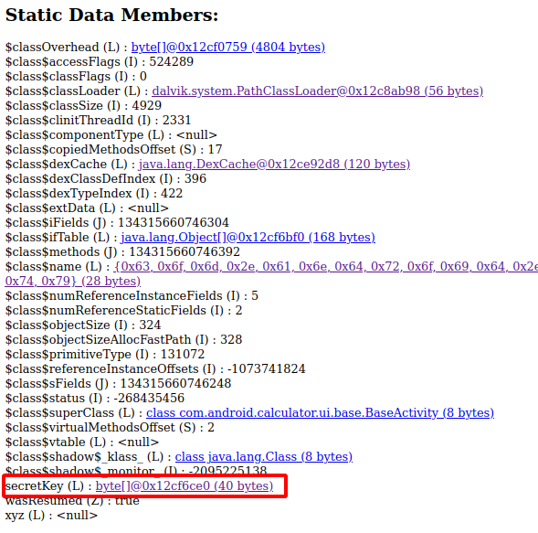
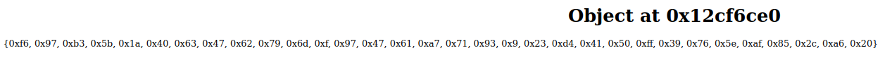

# PoliceForensic DGHACK 2023

### Description


Notre unité de police a récemment saisi le smartphone d'un individu suspecté d'actions malveillantes et a pu en réaliser un snapshot au moment de son arrestation.

Nous croyons fortement que le suspect a utilisé l'une de ses applications mobiles pour stocker des informations critiques qui nous permettraient de résoudre l'affaire.

Analysez la copie de son smartphone, sous la forme d'un snapshot d'AVD présent sur la machine fournie, pour trouver le flag.


### Challenge

Pour ce challenge on commence par essayer de trouver quelle application est susceptible de cacher des informations.

Pour cela, on regarde dans le dossier /data/app, le dossier d'installation des applications android de l'utilisateur.
On remarque qu'il a installé l'application "calculator", la calculatrice est normalement installée de base sur les devices donc c'est assez étrange.

Dans Le dossier /data/app/[base64(com.android.calculator)] on pouvait récupérer `base.apk` qui est l'apk de calculator. 

On l'ouvre dans jadx.

Dans le fichier manifest.xml on remarque 2 activités, KeyPadActivity et VaultActivity. Avec le nom de cette deuxième activité et en regardant rapidement les classes Java, on comprend que c'est bien l'application que nous recherchons.


En reversant l'application on comprend globalement que :
- les images sont stockées dans le dossier de l'application : `/data/data/com.android.calculator/files`.

- Ces images sont chiffrées en AES GCM et la clé de chiffrement est stockée dans un keystore -> `vaultKeyStore.keystore`.

- Pour ouvrir ce keystore il faut un mot de passe qui est un code PIN de minimum 4 caractères, entré par l'utilisateur lors de la première ouverture de l'application.
  
- L'IV est le nom du fichier chiffré sans l'extension : E46890BAE45E4E4C071ED57616408612.jpg; E4E02A2E33B01B138A46F073BA222060.jpg

Pour préciser, la méthode `handleKeyInput` regarde s'il y'a au moins 5 caractères rentrés sur la calculatrice (en comptant l'opérateur +, -, x ou / pour valider le code pin). Si c'est le cas, que le code PIN est valide et que l'opérateur est le bon, il récupère la clé avec la méthode `retrieveKey` et appelle `onPinCreated` qui déchiffre l'image avec `decryptImages`.
```java
public void handleKeyInput(String keyPressed) {
        String pin = this.calculator.getString(keyPressed);
        if (pin.length() > 4 && this.pinCodeValidator.isPinPossible(pin)) {
            String strippedPin = pin.substring(0, pin.length() - 1);
            if (!this.dataManager.hasPinCodeEnabled()) {
                if (generateSecretKey(pin)) {
                    onPinCreated(strippedPin, null);
                }
            } else if (this.pinCodeValidator.isActivatorPressed(pin, this.dataManager.getOperator())) {
                try {
                    Key key = this.cryptoManager.retrieveKey(strippedPin.toCharArray());
                    if (key != null) {
                        onPinCreated(strippedPin, key);
                        KeyPadActivity.secretKey = key.getEncoded();
                        KeyPadActivity.xyz = strippedPin.getBytes(StandardCharsets.UTF_8);
                    }
                } catch (KeyStoreException | NoSuchAlgorithmException | UnrecoverableEntryException e) {
                    e.printStackTrace();
                }
            }
        } else if (pin.length() == 1 && this.pinCodeValidator.isPinPossible(pin)) {
            return;
        }
        this.keyPadView.setResultView(this.calculator.getStrKey(keyPressed));
    }
```
```java
 private void onPinCreated(String pin, Key key) {
        this.calculator.setStrKey("0");
        this.keyPadView.setResultView("0");
        this.dataManager.setTempPin(pin);
        if (key == null) {
            moveToVaultActivity();
        } else {
            decryptImages(key);
        }
    }
```
#### I - Bruteforce (non concluant)

La première idée est de bruteforce l'ouverture du keystore car le password pour ouvrir celui-di est un simple code PIN. Pour cela il fallait identifié l'algorithme utilisé par le keystore comme étant BKS (bouncycastle) et télécharger la lib correspondante : bcprov-jdk18on-177.jar sur https://www.bouncycastle.org/latest_releases.html

La méthode pour ouvrir le Keystore en modifiant 2-3 trucs:

```java
public boolean retrieveKey(char[] passPhrase) throws KeyStoreException, UnrecoverableEntryException, NoSuchAlgorithmException, NoSuchProviderException {
        Security.addProvider(new BouncyCastleProvider());
        KeyStore ks = KeyStore.getInstance("BKS", "BC");
        try {         
            FileInputStream fis = new FileInputStream("vaultKeyStore.keystore");
            try {
                System.out.println(Arrays.toString(passPhrase));
                ks.load(fis, passPhrase);
                System.out.println("CODE PIN : " + Arrays.toString(passPhrase));
                return true;
            } catch(IOException | NoSuchAlgorithmException | CertificateException e){

                return false;
            }
        } catch (IOException e) {
            System.out.println("Can't open file");
        }
        return false;
    }
```

Il faut ensuite tester pour tous les codes PIN à partir 4. Méthode qui n'a pas abouti pour ma part, j'ai testé jusqu'à 7 PIN, après cela demandait trop de temps.

#### II - deuxième méthode

La deuxième méthode consiste à dump la mémoire de l'application :

- `adb shell ps | grep com.android.calculator`
- `adb shell am dumpheap [pid] /sdcard/Downloads/calculator.hprof`
- `adb pull /sdcard/Downloads/calculator.hprof`

On récupère un hprof qu'on ne peut peux pas analyser comme ça, il faut le convertir au bon format hprof : 
`hprof-conv ./calculator.hprof android.hprof`

Enfin on peut analyser le fichier avec jhat : `jhat -port 7401 -J-Xmx4G ./android.hprof`

Sur http://localhost:7401 on peut regarder l'état de la mémoire Java au moment où le dump a été généré, l'état des objets java, les liens entre eux etc... on cherche pour KeyPadActivity car cette class possède un attribut `secretKey` qui doit contenir notre clé AES.





Nous avons la clé AES qui nous intéresse : F697B35B1A40634762796D0F974761A771930923D44150FF39765EAF852CA620

Il nous reste plus qu'à déchiffrer l'image. Voilà mon script :

```Python
from cryptography.hazmat.primitives.ciphers.aead import AESGCM
import binascii

def decrypt_image(ciphertext, key, iv):
    aesgcm = AESGCM(key)
    plaintext = aesgcm.decrypt(iv, ciphertext, None)
    return plaintext

hex_key = 'F697B35B1A40634762796D0F974761A771930923D44150FF39765EAF852CA620'    
hex_iv = 'E4E02A2E33B01B138A46F073BA222060'

# Convert hex strings to bytes
key = binascii.unhexlify(hex_key)
iv = binascii.unhexlify(hex_iv2)

# Read the encrypted image from file
with open('/home/nemo/Documents/cyber/dghack/policeforensic/apps/com.android.calculator/r/app_image/E4E02A2E33B01B138A46F073BA222060.jpg', 'rb') as file:
    ciphertext = file.read()

# Decrypt the image
decrypted_image = decrypt_image(ciphertext, key, iv)

# Save the decrypted image to a new file
with open('decrypted_image.jpg', 'wb') as file:
    file.write(decrypted_image)
```

FLAG : 

