# Rapport de recherche – Challenge EC2 "Récupération de données" (2025)

**Équipe :** `ESNArcotrafiquants`  
**Date :** `01/03/2025`

---

## Introduction

Ce rapport présente la méthodologie, les outils utilisés, les résultats et les captures d'écran pour chacune des questions du challenge. Chaque réponse est justifiée et détaillée comme requis dans un cadre forensic.

```bash
$ md5sum KIKI-Serveur.dd 
8a00916b95cfa41da5cc118318341f83  KIKI-Serveur.dd
```

L'image disque a été copiée sur plusieurs supports et un hash a été effectué sur chacunes des images pour vérifier l'intégrité

---

## 🛠️ Outils utilisés

- `file` : Identification du type de fichier image
- `qemu-nbd` : Connexion de l’image disque à un périphérique bloc pour accès direct
- `fdisk`, `parted` : Détection et affichage des partitions présentes sur le disque
- `mount` : Montage manuel des partitions
- `find`, `grep`, `stat`, `du` : Recherche de fichiers, statistiques et métadonnées
- `strings` : Analyse des fichiers suspects pour signature ASCII ou Unicode
- `Autopsy` : Exploration approfondie de l’image disque, récupération de fichiers supprimés
- `TestDisk` / `PhotoRec` : Restauration de fichiers supprimés (avec ou sans nom original)
- `secretsdump.py` : Extraction des hachages depuis la base SAM
- `crackstation.net` : Brute-force en ligne des mots de passe hachés
- `dnSpy` : Rétro-ingénierie des exécutables .NET
- `API Monitor` / `Procmon` : Surveillance des processus et appels systèmes
- `Hayabusa` / `EvtxECmd`, `TimelineExplorer` : Analyse des journaux d’événements Windows (fichiers EVTX)
- `getfattr` : Accès aux flux alternatifs de données (ADS) sous Linux
- `7-Zip` : Extraction d’archives


---

##  Réponses aux questions

### Question 1 :  
**Quel est le vrai format ‘original’ du fichier image fourni par le prestataire informatique ?**  

 **Réponse :**  
Le vrai format est un fichier vmdk. Il ne s’agit donc pas d’un dump brut de disque (raw) comme son extension `.dd` semble nous indiquer.

 **Méthodologie :**  
Lorsqu'on a le fichier sous la main, on peut identifier le type de fichier avec la commande `file`.

Le disque "KIKI-Serveur.dd" est de type "VMware4 disk image", cela indique qu'il s'agit d'une image de disque virtuelle VMware au format VMDK (Virtual Machine Disk).

📸 **Captures :**  

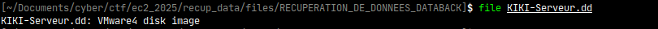


---

### Question 2  
**Quelles sont les tailles des partitions (et leur type de système de fichier) présentes sur le ‘disque’ ?**

**Réponse :**  
Les partitions sont :
- Une partition `EFI` de 200M
- Une partition `réservée Microsoft` de 128M
- Une patition windows `NTFS` de 299,7G

**Méthodologie :**  
Nous pouvons monter les différentes partitions du vmdk avec `qemu-nbd`. `qemu-nbd` est un outil en ligne de commande qui permet de monter un disque virtuel comme un périphérique bloc (/dev/nbdX) sur un système Linux.

On doit charger le module network block device (nbd) :

```
sudo rmmod nbd
sudo modprobe nbd max_part=16
```

Ensuite on attache l’image .dd à l’un des périphériques nbd :

```
sudo qemu-nbd -c /dev/nbd0 KIKI-Serveur.dd
```

On obtient un périphérique bloc /dev/nbd0, ainsi que plusieurs périphériques de partition /dev/nbd0p*.

Avec fdisk, nous pouvons récupér ces informations.


📸 **Captures :**  

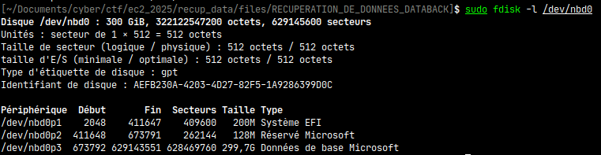


---

### Question 3  
**Quelle est la date la plus ancienne, des fichiers/dossiers présents à la racine de la partition principale du ‘disque’ ?**

**Réponse :**  
C'est le fichier `BOOTNXT`

**Méthodologie :**  
Lister les fichier avec la commande suivante qui permet d'avoir l'ordre d'apparition sur le disque :`ls -lat`.

📸 **Captures :**  
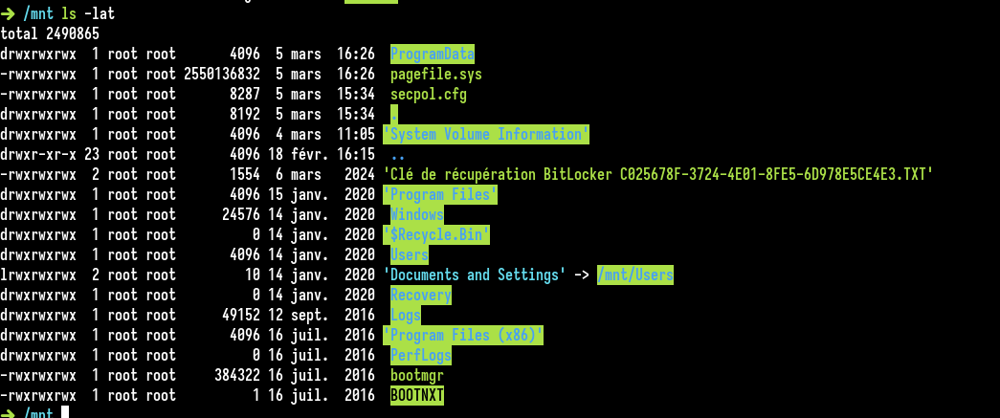


---

### Question 4  
**Quel volume de données (utilisée et potentielle) contient la partition principale ?**

**Réponse :**  
La partition principale est /dev/nbd0p3 une fois montée, elle est identifiée comme une partition "Données de base Microsoft" qui est une partition NTFS. C'est le système de fichiers par défaut utilisé par Windows depuis Windows XP.

**Méthodologie :**  
Etant donné la taille de la partition et le type de partition, on l'identifie comme la partition principale.


---

### Question 5  
**Combien de fichiers/dossiers (potentiels) comporte la partition principale ?**

**Réponse :**  
Il y a 192941 fichiers sur cette partition.

**Méthodologie :**  
On utilise la commande suivante : `find . -type f | wc -l` qui permet de parcourir tous les fichiers présents sur le disque et lister le nombre de lignes donc le nombre de fichiers.

📸 **Captures :**  
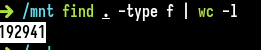


---

### Question 6  
**Quel est le nom de l’utilisateur principal ?**

**Réponse :**  
L'utilisateur principal est `kikiVendeen`

**Méthodologie :**  
On liste les utilisateurs du système en accédant au répertoire C:\Users. L'utilisateur kikiVendeen est le seul à ne pas être un compte système.

📸 **Captures :**  


---

### Question 7  
**Quel est son mot de passe de session ?**

**Réponse :**  
Son mot de passe est `kiki85`.

**Méthodologie :**  
On extrait les fichiers `SAM` et `SYSTEM`, contenant les hachages des mots de passe, puis on utilise `secretsdump.py` pour récupérer les hachages. Enfin, on effectue une attaque de type « brute force » avec CrackStation pour retrouver le mot de passe.

📸 **Captures :** 
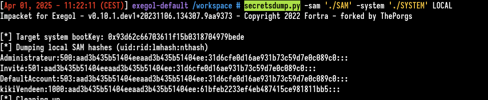

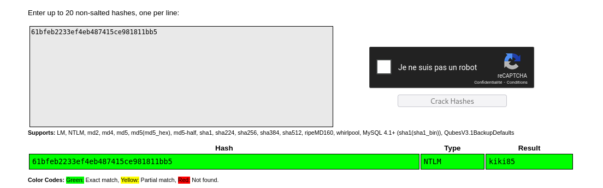


---

### Question 8  
**Quels sont les répertoires contenant le plus de données ?**

**Réponse :**  
``/Users/kikiVendeen/Documents/``

**Méthodologie :**  
On utilise la commande suivante pour analyser la taille des répertoires : : `sudo du -hs * | sort -rh | head -5`. Cette commande permet de classer les dossiers par taille et d'identifier les plus volumineux.

📸 **Captures :**  

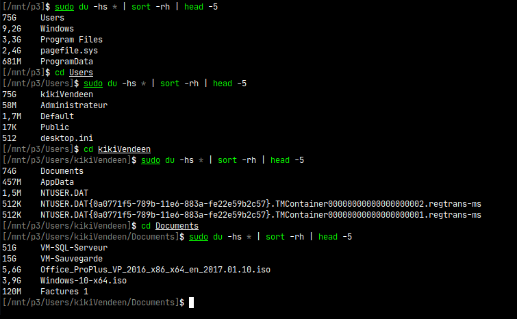


---

### Question 9  
**Collectez plusieurs exemplaires des notes de rançons. Notez-vous des différences ou des choses importantes sur celles-ci ? (Réponse libre)**

**Réponse :**  
La différence est la date de création des notes de rançon.

**Méthodologie :**  
Avec la commande `sudo find ./ -name "*READ_ME*"` on observe plusieurs notes de rançon.

- `/Documents/Factures 1/READ_ME.txt`
- `/Documents/VM-SQL-Serveur/VM-SQL-Serveur/READ_ME.txt`
- `/Documents/VM-SQL-Serveur/VM-SQL-Serveur/Virtual Hard Disks/READ_ME.txt`
- `/Documents/VM-SQL-Serveur/VM-SQL-Serveur/Virtual Machines/DF4F8309-CE67-4267-8F26-67A4F85CA435/READ_ME.txt`
- `/Documents/VM-SQL-Serveur/VM-SQL-Serveur/Virtual Machines/READ_ME.txt`

La commande `diff` entre tous les fichiers n'indique aucune différence dans le contenu.

La commade :
`sudo find ./ -name "*READ_ME*" -type f -exec stat --format '%n | A: %x | M: %y | C: %z' {} \;` 

nous permet de vérifier : 

%n → nom du fichier
%x → dernier accès
%y → dernière modification du contenu
%z → dernier changement des métadonnées

On remarque que la note `/Documents/Factures 1/READ_ME.txt` est créée le 2025-03-05 à 22:28 alors que les autres sont créées le 2025-03-06 à 08:32. La différence se situe au niveau de la date de création de la note de rançon.

📸 **Captures :**  

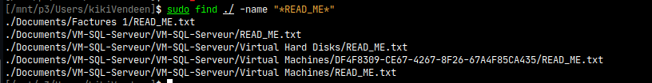

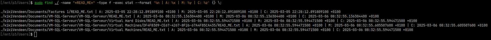


---

### Question 10  
**Quels types de modifications (tout type) les fichiers du client ont-ils subi ?**

**Réponse :**  
Les fichiers du clients ont été chiffrés.

**Méthodologie :**  
On accède aux différents dossier de l'utilisateur, exemple : 
 - Users/kikiVendeen/Documents/Factures 1

En essayant d'ouvrir des pdf on constate que les fichiers sont endommagés.
la commande strings permet de voir que les fichiers ne comportent pas la structure habituelle d'un pdf.

📸 **Captures :**  

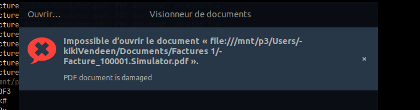

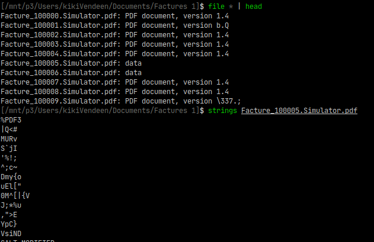

---

### Question 11  
**Si vous avez trouvé le chiffreur, quel est son vrai nom de fichier ?**

**Réponse :**  
Le nom du chiffreur est `RansomEmulator.net.exe`

**Méthodologie :**  
Conversion de l'image vmdk en image raw avec qemu :`qemu-img convert ./KIKI-Serveur.dd -m 16 -p -O raw converted.raw`

On analyse l'image disque au fromat `raw` avec l'outil `Autopsy`, on remarque que des fichiers ont été supprimés, dont deux executables windows.

Les executables sont les mêmes mais proviennent de localisation différentes : 
- C:\Users\kikiVendeen\Documents\RansomEmulator.net.exe
- C:\Users\kikiVendeen\Documents\VM-SQL-Serveur\RansomEmulator.net.exe


On confirme que le chiffreur à été exécuté à ces deux localisations différentes d'où la présence de "READ_ME.txt" dans : `Factures 1` et `VM-SQL-Serveur` et la différence de date de création des notes de rançon.


📸 **Captures :**  

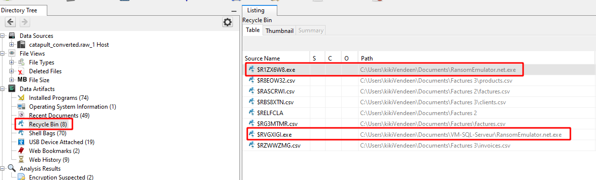

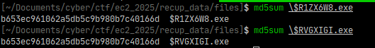

*Capture d'écran de checksum des deux exécutables récupérés via autopsy pour s'assurer que ce sont les mêmes*

---

### Question 12  
**Avez-vous trouvé le(/les) mot(s) de passe (nécessaire pour une méthode de déchiffrement) ? Décrivez comment vous les avez trouvés.**

**Réponse :**  
Il y a deux mots de passes possibles, un pour le mode XOR et un pour le mode AES.

**Méthodologie :**  
L'exécutable recupéré est un .exe sous .NET, on utilise donc `dnspy` pour analyser le chiffreur. Il y a deux méthodes intéresantes, la `main` lancée et `decrypt` qui semble chiffrer ou déchiffrer des fichiers.

En debuggant l'application on remarque qu'il charge un second stage en .NET.

En analysant avec `API Monitor`, on voit que le processus lance une commande `cmd` qui lit dans l'ADS `Informations` du malware et l'affiche avec la commande `more`. On peut récupérer le contenu de l'ADS avec : 
```
getfattr -d -m ".*" --absolute-names \$R1ZX6W8.exe
# file: $R1ZX6W8.exe
user.Informations=0sQ0hATEVDMiQkJCANCg==
```

Après le `testdisk` lancé en quesion 16, on récupère un deuxième exécutable : `sudo find ./ -name "*.exe"` -> `./S-1-5-21-2242803946-2065664748-1845606631-1000/$R23BXK5.exe`.

Il s'agit du même malware non obfusqué. `Autopsy` nous confirme l'utilisation de `$R23BXK5.exe` avec l'ADS `Informations`.

Avec la rétro ingénierie on récupère les 2 modes de chiffrement, AES et XOR : 
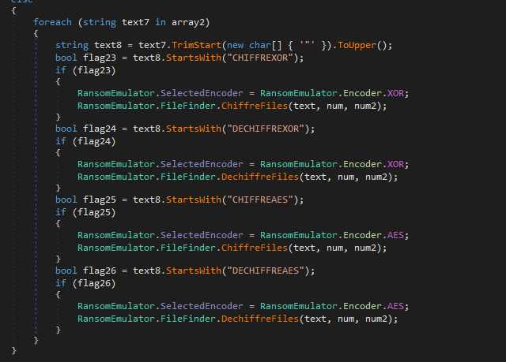


📸 **Captures :**  

Stage 1 obfusqué: 
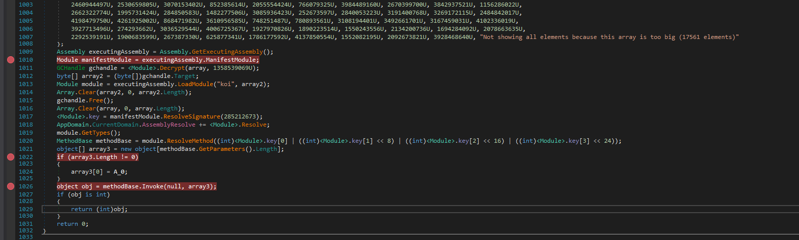

Stage 2 .NET obfusqué: 
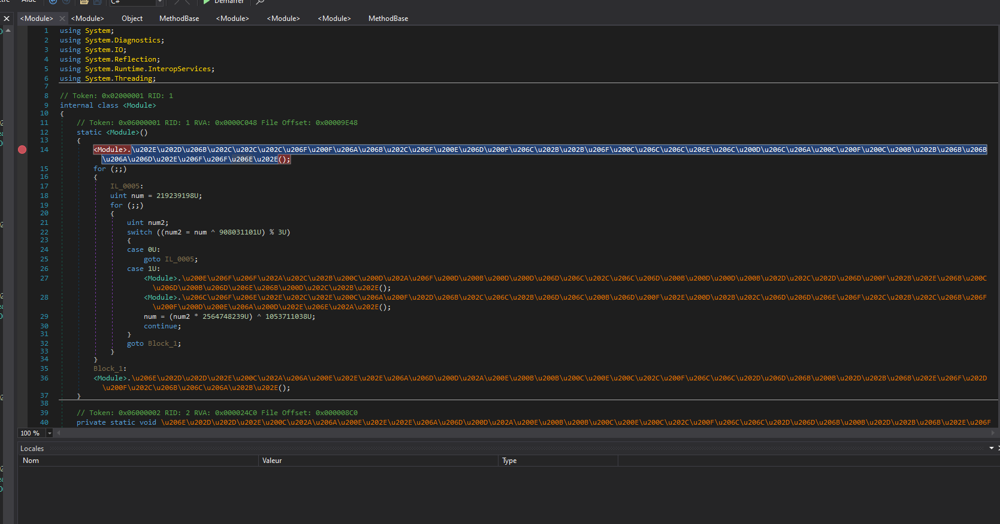

Lancment de cmd vu par API Monitor :
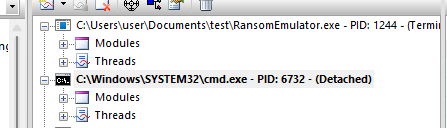

Commande vue par procmon :
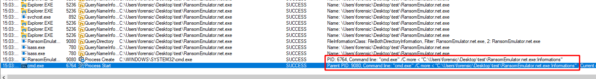

Autopsy qui retrouve `$R23BXK5.exe` avec l'ADS `Informations`
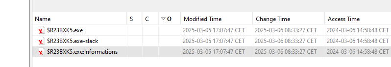


---

### Question 13  
**Trouvez tous les arguments qui peuvent être acceptés et lancés dans le chiffreur.**

**Réponse :**  
Voici les arguments pris par le chiffreur : 
- `CHIFFREXOR`
- `DECHIFFREXOR`
- `CHIFFREAES`
- `DECHIFFREAES`
- `C:`
- `F:`
- `D:`
- `P:`
- `T:`

**Méthodologie :**  
Utilisation d'API monitor avec un argument de lancement et recherche des différentes strings si elles sont comparées avec notre input connu.

Puis une fois le binaire déchiffré récupéré comme expliqué avec la question 12, on peut confirmé le rôle de chaque commande : 

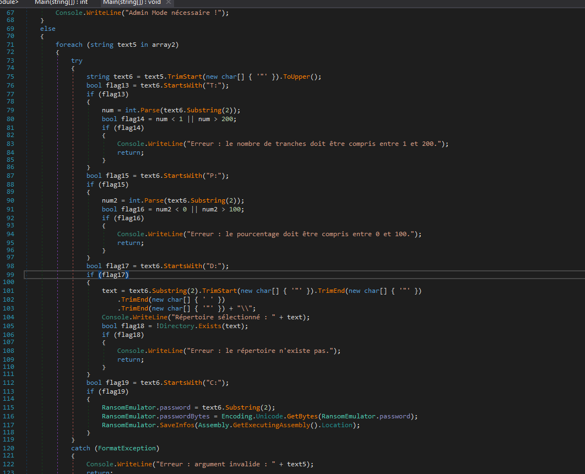

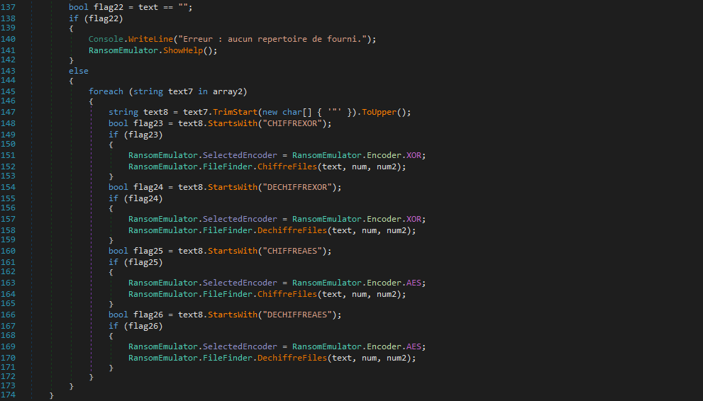


📸 **Captures :**  
Exemple de récupération d'argument avec API monitor
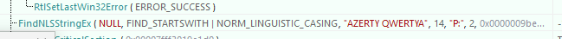


---

### Question 14  
**Combien y a-t-il d’événements Windows en niveau « erreur » dans ce serveur (toutes catégories confondues) ?**

**Réponse :**  
Il y a 1612 événements Windows en niveau « erreur » dans ce serveur.

**Méthodologie :**  
pour récupérer les événements Windows, on doit aller dans `C:\Windows\System32\winevt\Logs\`. Ce dossier contient tous les fichiers evtx qui sont les journaux d'événements Windows au format binaire, contenant les logs système, applicatifs et de sécurité générés par le système d'exploitation.

On peut parser les logs evtx avec l'outil `EvtxECmd` de Eric Zimmerman. On récupère un csv qu'on peut lire avec l'outil `TimelineExplorer` du même autheur. On filtre les évènements par niveau "error".

📸 **Captures :**  

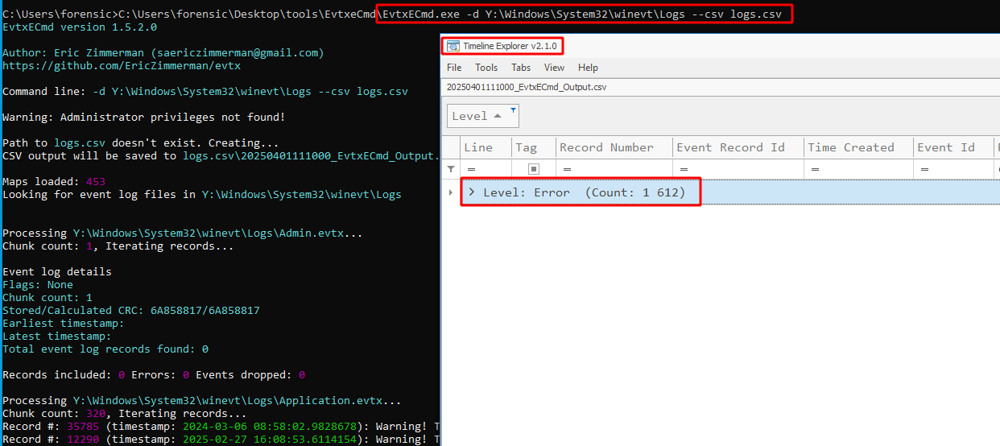


---

### Question 15  
**Trouvez le maximum d’informations sur les dernières actions menées par le ‘hackeur’. (11 actions à trouver)**

**Réponse :**  
- L'antivirus windows-defender a été désactivé

**Méthodologie :**  
Lecture des EVTX avec `hayabusa`.

📸 **Captures :**  
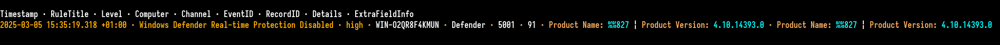


---

### Question 16  
**Quel montant total TTC comporte le fichier Facture_73915.pdf ?**

**Réponse :**  
Le montant total TTC de la facture est `24240,53 €`

**Méthodologie :**  
Autopsy nous indique que Facture_73915.pdf a été supprimée, et nous ne pouvons pas le récupérer depuis l'outil.

Nous pouvons utiliser des outils qui font du carving pour récupérer les fichiers supprimés comme `photorec` ou `testdisk`. Photorec récupère bien les fichiers mais les noms sont normés et pas ceux qui étaient sur le système de fichier.

La commande `sudo testdisk /dev/nbd0p3` permet de récupérer les fichiers supprimés d'un disque.

📸 **Captures :**  

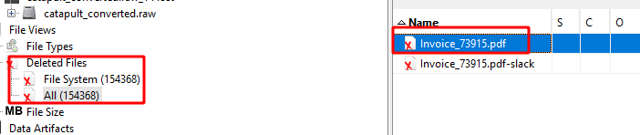

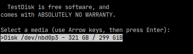

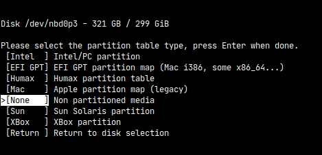

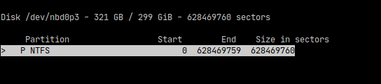

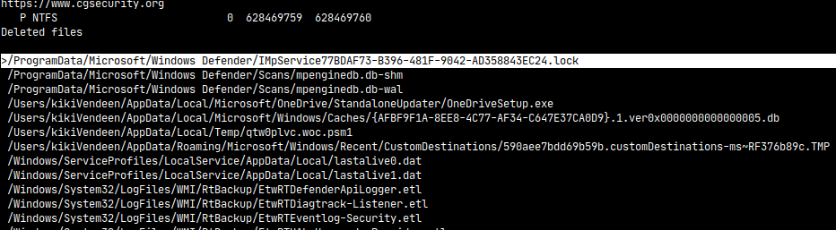

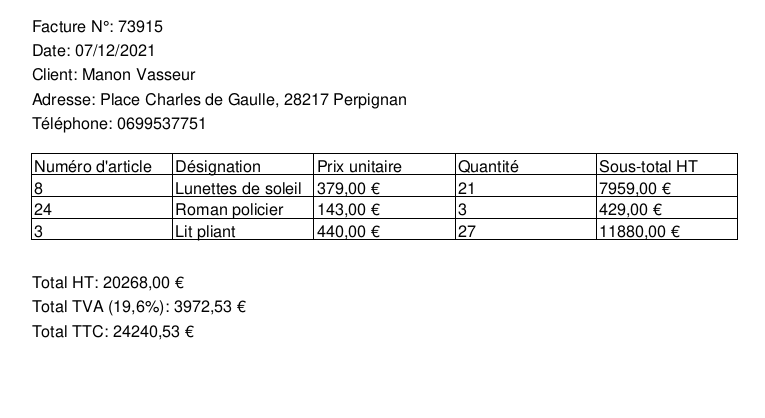

---

### Question 17  
**Quels sont les noms/prénom/adresse/téléphone du client dans le fichier Invoice_67094.pdf ?**

**Réponse :**  
Voici les informations : 
```
Client: Karine Bernard
Adresse: Place Charles de Gaulle, 24874 Perpignan
Téléphone: 0644480374
```

**Méthodologie :**  
Nous avons récupéré le fichier de la même manière que la question 16.

📸 **Captures :**  
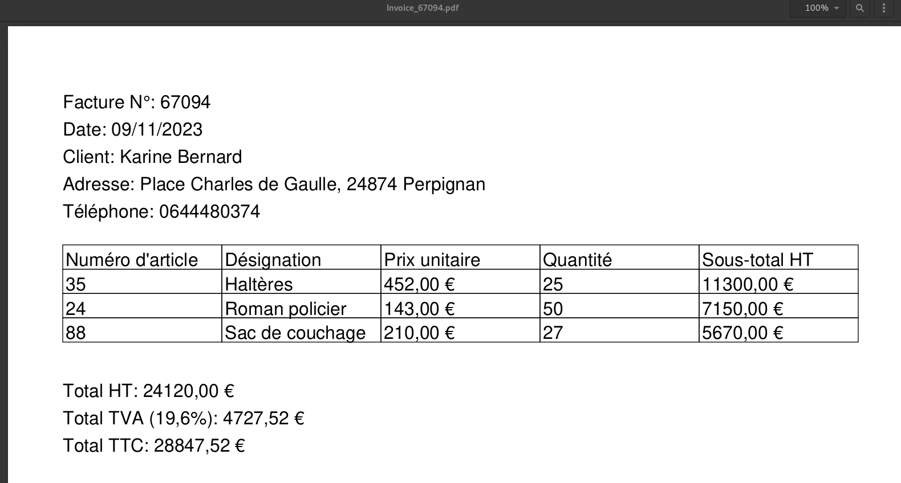


---

### Question 18  
**Quel montant total TTC trouvez-vous dans le fichier Facture_113061.Simulator.pdf ?**

**Réponse :**  
...

**Méthodologie :**  
...

📸 **Captures :**  
...

---

### Question 19  
**Quel fichier n’a rien à faire au milieu des factures PDF ?**

**Réponse :**  
le fichier est dans Facture 1 et c'est `partenaireequipe.webp`

**Méthodologie :**  

`find ./ -type f ! -name "Facture*"`

📸 **Captures :**  


---

### Question 20  
**Où se situent les fichiers de la base de données de comptabilité ? (Emplacement et chemin précis)**  
**Expliquez en détail comment vous les avez trouvés.**

**Réponse :**  
...

**Méthodologie :**  
...

📸 **Captures :**  
...

---

### Question 21  
**Où se situe le fichier de sauvegarde de la base de données de comptabilité ? (Emplacement et chemin précis)**  
**Expliquez en détail comment vous l’avez atteint.**

**Réponse :**  
...

**Méthodologie :**  
...

📸 **Captures :**  
...

---

### Question 22  
**Où se situent les deux dossiers de ‘partage de fichier’ ? (Emplacement et chemin précis)**  
**Expliquez en détail comment vous les avez trouvés.**

**Réponse :**  
Les répartoires sont : 
- `\\PC-JP2\`

**Méthodologie :**  
Dans le dossier `Recent` de l'utilisteur, de nombreux fichiers lnk (raccourcis) sont présents et permettent d'accèder à certains fichiers.

Par simplicité on utilise l'outil `strings -el` (encoding UTF-16) pour récupérer les paths pointés par le LNK.

📸 **Captures :**  
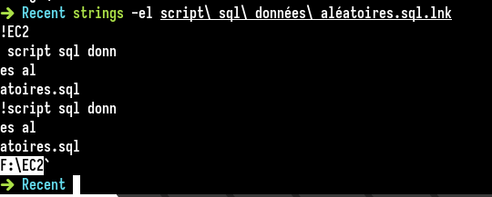
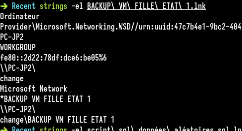


---

### Question 23  
**Quel est le nom de l’auteur du fichier déchiffré ERIC_ED293341.Simulator.pdf ?**

**Réponse :**  
...

**Méthodologie :**  
...

📸 **Captures :**  
...

---

### Question 24  
**Quelles sont les trois tables contenant les principales informations de comptabilité ?**

**Réponse :**  
...

**Méthodologie :**  
...

📸 **Captures :**  
...

---

### Question 25  
**Quelle est la date la plus récente de facture dans les tables ?**

**Réponse :**  
...

**Méthodologie :**  
...

📸 **Captures :**  
...

---

### Question 26  
**Combien de clients au total sont enregistrés dans la base ?**

**Réponse :**  
...

**Méthodologie :**  
...

📸 **Captures :**  
...

---

### Question 27  
**Quel est le contenu (décodé) de l’EASTER EGG caché dans une des tables de la base de données ?**

**Réponse :**  
...

**Méthodologie :**  
...

📸 **Captures :**  
...

---

## 📂 Résultats importants

- Base de données récupérée : Non
- Fichiers de facturation récupérés : Oui
- Répertoires de partage trouvés : Oui
- Données valides/ouvrables : Pas entièrement
- Méthodes de chiffrement identifiées : AES et XOR


---

## 🏁 Conclusion

Notre équipe a procédé à une analyse approfondie de l’image disque fournie et a réussi à récupérer des éléments essentiels demandés. Le travail a été mené dans une approche méthodique et justifiée, respectant les exigences d’un cadre d’enquête forensic.
